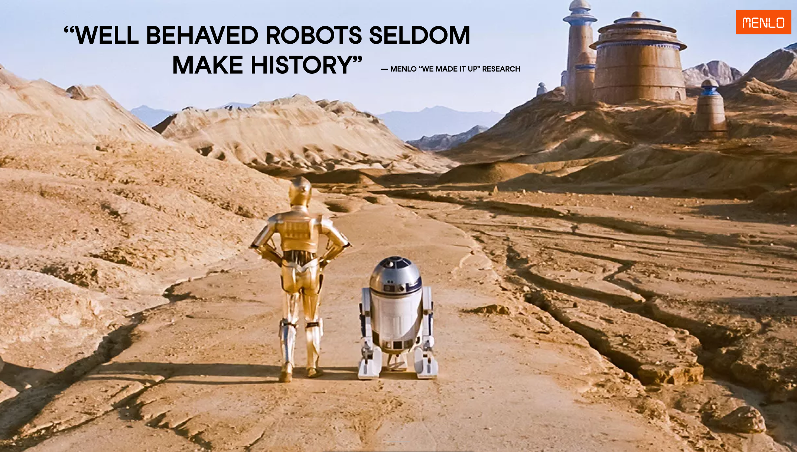

# Menlo Research

todo update

## Welcome to the Anti-Robot Robot Club!

## Quicklinks
todo

## Contact Us
- todo

Asimov is developed by [Menlo Research](https://menlo.ai). Our other "robots" in the wild include [Jan](https://jan.ai), a personal intelligence.
