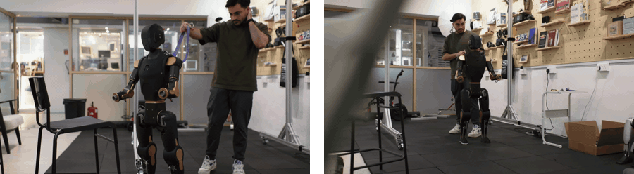
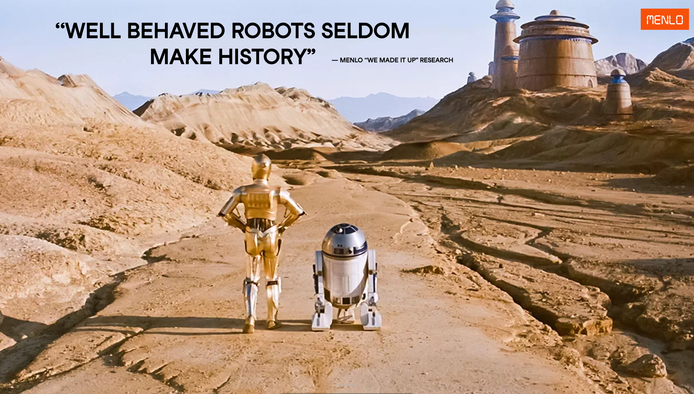

# Menlo Research

Menlo is a Physical AI company that deploys robots to solve real world problems.

&nbsp;
&nbsp;
&nbsp;

## Our story

Menlo started with a simple mission: build the brain for robots. We began with [Jan](https://jan.ai/), an open source AI assistant that has now reached 6 million downloads. Then we [built legs](https://docs.menlo.ai/asimov/0). Then a torso. Then [a full humanoid](https://docs.menlo.ai/asimov/1).

The people building Menlo come from computing, engineering, political science, and everywhere in between. We're spread across Singapore and Vietnam, with a US office opening soon.

 

<picture>
  <source media="(max-width: 640px)" srcset="locomotion-mobile.gif">
  
</picture>

## Follow our journey

- **[Research](https://www.menlo.ai/research)**: Read our latest research
- **[Careers](https://www.menlo.ai/careers)**: Come build with us
- **[Events](https://luma.com/user/menlo_research)**: Catch us in person or online
- **[Get in touch](https://menlo.ai/talk)**: Deploy robots, collaborate on research, or find another way to work with us

 

